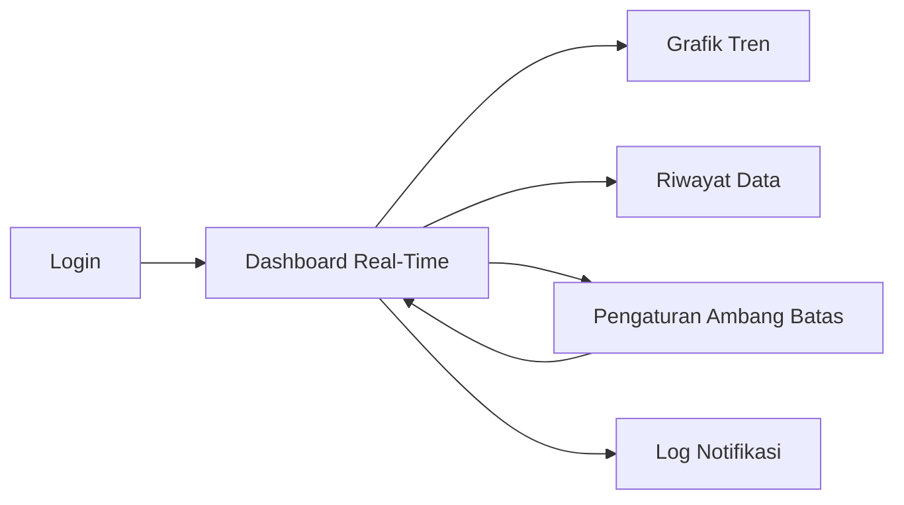
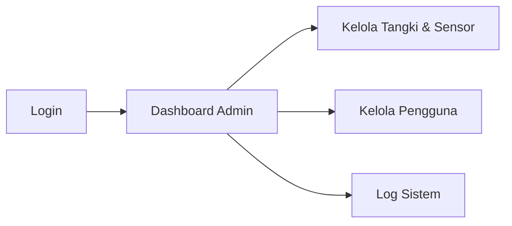

# RANCANGAN UX/UI — Digital Twin Tangki Air

## 1. Tujuan Desain
Merancang antarmuka digital twin tangki air yang mudah dipakai operator untuk memantau ketinggian dan kondisi air (suhu, kekeruhan, TDS) secara real-time, serta memudahkan admin mengelola tangki, sensor, dan pengguna. Status kondisi tangki dan air ditampilkan dengan indikator visual yang jelas (warna, label, animasi level air).

## 2. User Flow

### Alur Operator


### Alur Admin


## 3. Wireframe Halaman

### A. Halaman Login

```
┌──────────────────────────────────────┐
│                                      │
│       DIGITAL TWIN TANGKI AIR        │
│                                      │
│   ┌────────────────────────────────┐ │
│   │ Username                       │ │
│   └────────────────────────────────┘ │
│   ┌────────────────────────────────┐ │
│   │ Password                       │ │
│   └────────────────────────────────┘ │
│   ┌────────────────────────────────┐ │
│   │           [ LOGIN ]            │ │
│   └────────────────────────────────┘ │
│                                      │
└──────────────────────────────────────┘
```

### B. Dashboard Real-Time (Operator)

```
┌──────────────────────────────────────────────────────────────────┐
│  Digital Twin Tangki  [Dashboard] [Grafik] [Riwayat] [Atur] [Logout] │
├──────────────────────────────────────────────────────────────────┤
│  Tangki: [Tangki Utama v]   Sensor: ● Terhubung   Update: 10:32:05 │
├──────────────────────────────────────────────────────────────────┤
│   ┌──────────────┐    ┌─────────────┐ ┌─────────────┐ ┌─────────────┐ │
│   │   ┌──────┐   │    │  KETINGGIAN │ │    SUHU     │ │ KEKERUHAN   │ │
│   │   │      │   │    │    120 cm   │ │   27,5 °C   │ │   3,2 NTU   │ │
│   │   │ ~~~~ │   │    │     (75%)   │ │  [ NORMAL ] │ │  [ NORMAL ] │ │
│   │   │ ~~~~ │   │    │  [ NORMAL ] │ └─────────────┘ └─────────────┘ │
│   │   │ ~~~~ │   │    └─────────────┘ ┌─────────────┐ ┌─────────────┐ │
│   │   └──────┘   │                    │     TDS     │ │ STATUS UMUM │ │
│   │   Level 75%  │                    │   320 ppm   │ │  [ NORMAL ] │ │
│   └──────────────┘                    │  [ NORMAL ] │ │             │ │
│    (visual tangki)                    └─────────────┘ └─────────────┘ │
├──────────────────────────────────────────────────────────────────┤
│  Notifikasi Terbaru                                              │
│  10:15 | Level air turun di bawah 80%             | Info         │
│  09:40 | TDS mendekati batas atas                  | Waspada      │
└──────────────────────────────────────────────────────────────────┘
```

### C. Halaman Grafik Tren

```
┌──────────────────────────────────────────────────────────────────┐
│  <- Dashboard          GRAFIK TREN                               │
├──────────────────────────────────────────────────────────────────┤
│  Parameter: [Ketinggian v]   Rentang: [1 Jam][24 Jam][7 Hari]    │
├──────────────────────────────────────────────────────────────────┤
│  cm                                                              │
│  160 |                                                           │
│  120 |      ____        ______                                   │
│   80 |  ___/    \___   /      \___                               │
│   40 | /             \_/                                         │
│    0 +-----------------------------------------------> waktu     │
│       06:00    09:00    12:00    15:00    18:00                  │
│  - - - batas minimum (40 cm)        - - - batas maksimum (150 cm)│
├──────────────────────────────────────────────────────────────────┤
│  Min: 45 cm    Maks: 148 cm    Rata-rata: 102 cm                 │
└──────────────────────────────────────────────────────────────────┘
```

### D. Halaman Riwayat Data

```
┌──────────────────────────────────────────────────────────────────┐
│  <- Dashboard          RIWAYAT DATA SENSOR                       │
├──────────────────────────────────────────────────────────────────┤
│  Filter: [Tangki v] [Tanggal] [Status v] [Cari]  [ Ekspor CSV ]  │
├──────────────────────────────────────────────────────────────────┤
│  Waktu     | Level (cm) | Suhu (°C) | Keruh (NTU) | TDS   | Status │
│  ----------|------------|-----------|-------------|-------|------- │
│  10:32:05  | 120        | 27,5      | 3,2         | 320   | Normal │
│  10:31:55  | 119        | 27,5      | 3,1         | 318   | Normal │
│  10:31:45  | 118        | 27,4      | 3,3         | 355   | Waspada│
│                                                                  │
│        < 1  2  3  4 >                                           │
└──────────────────────────────────────────────────────────────────┘
```

### E. Halaman Pengaturan Ambang Batas

```
┌──────────────────────────────────────────────────────────────────┐
│  <- Dashboard          PENGATURAN AMBANG BATAS                   │
├──────────────────────────────────────────────────────────────────┤
│  Tangki : [Tangki Utama v]                                       │
│                                                                  │
│  Parameter     | Batas Bawah | Batas Atas                        │
│  --------------|-------------|------------                       │
│  Ketinggian    | [ 40 ] cm   | [ 150 ] cm                        │
│  Suhu          | [ 15 ] °C   | [ 35 ] °C                         │
│  Kekeruhan     |      -      | [ 5 ] NTU                         │
│  TDS           |      -      | [ 500 ] ppm                       │
│                                                                  │
│  Kirim notifikasi via: [x] In-app  [ ] Email  [ ] Telegram       │
├──────────────────────────────────────────────────────────────────┤
│                        [ BATAL ]  [ SIMPAN PENGATURAN ]          │
└──────────────────────────────────────────────────────────────────┘
```

### F. Halaman Log Notifikasi

```
┌──────────────────────────────────────────────────────────────────┐
│  <- Dashboard          LOG NOTIFIKASI                            │
├──────────────────────────────────────────────────────────────────┤
│  Filter: [Tingkat v] [Tanggal] [Cari]                            │
├──────────────────────────────────────────────────────────────────┤
│  Waktu     | Tangki       | Pesan                    | Tingkat   │
│  ----------|--------------|--------------------------|---------- │
│  10:15     | Tangki Utama | Level air di bawah 40 cm | Bahaya    │
│  09:40     | Tangki Utama | TDS mendekati 500 ppm    | Waspada   │
│  08:05     | Tangki Utama | Level kembali normal     | Normal    │
└──────────────────────────────────────────────────────────────────┘
```

### G. Dashboard Admin

```
┌──────────────────────────────────────────────────────────────────┐
│  Dashboard Admin   [Tangki & Sensor] [Pengguna] [Log] [Logout]   │
├──────────────────────────────────────────────────────────────────┤
│  ┌─────────────┐ ┌─────────────┐ ┌─────────────┐ ┌─────────────┐ │
│  │    TANGKI   │ │    SENSOR   │ │    ALERT    │ │   DATA      │ │
│  │    AKTIF    │ │   ONLINE    │ │  HARI INI   │ │  TERCATAT   │ │
│  │      3      │ │    11/12    │ │      4      │ │   25.480    │ │
│  └─────────────┘ └─────────────┘ └─────────────┘ └─────────────┘ │
├──────────────────────────────────────────────────────────────────┤
│  Status Tangki Terkini                                           │
│  Tangki       | Level | Kualitas Air | Status                    │
│  -------------|-------|--------------|--------                   │
│  Tangki Utama | 75%   | Baik         | Normal                    │
│  Tangki B     | 28%   | Baik         | Waspada                   │
│  Tangki C     | 90%   | Keruh        | Bahaya                    │
└──────────────────────────────────────────────────────────────────┘
```

### H. Halaman Kelola Tangki & Sensor (Admin)

```
┌──────────────────────────────────────────────────────────────────┐
│  <- Dashboard        KELOLA TANGKI & SENSOR                      │
├──────────────────────────────────────────────────────────────────┤
│  [ + Tambah Tangki ]                Cari: [ __________ ]         │
├──────────────────────────────────────────────────────────────────┤
│  ID | Nama Tangki   | Kapasitas | Lokasi  | Sensor | Aksi        │
│  ---|---------------|-----------|---------|--------|-------------│
│  01 | Tangki Utama  | 1.000 L   | Gedung A| Online | Edit Hapus  │
│  02 | Tangki B      | 500 L     | Gedung B| Online | Edit Hapus  │
├──────────────────────────────────────────────────────────────────┤
│  FORM TANGKI BARU                                                │
│  Nama Tangki : [ ______________________ ]                        │
│  Kapasitas   : [ ______ ] L      Tinggi Tangki: [ ______ ] cm    │
│  Lokasi      : [ ______________________ ]                        │
│  Sumber Data : [ Simulator / Sensor Nyata v ]                    │
│  Sensor      : [x] Level  [x] Suhu  [x] Kekeruhan  [x] TDS       │
│                                                                  │
│                        [ BATAL ]  [ SIMPAN TANGKI ]              │
└──────────────────────────────────────────────────────────────────┘
```

## 4. Palet Warna & Indikator

| Kondisi | Warna | Kode | Keterangan |
|---------|-------|------|------------|
| Normal / Online | Hijau | #28a745 | Semua parameter dalam batas aman / sensor terhubung |
| Waspada | Kuning | #ffc107 | Parameter mendekati batas atau level rendah |
| Bahaya / Offline | Merah | #dc3545 | Parameter melewati batas (kritis) / sensor terputus |
| Air (visual tangki) | Biru | #0d6efd | Warna isi air pada visual tangki |

## 5. Komponen UI Utama

| Komponen | Fungsi |
|----------|--------|
| Navbar | Navigasi ke Dashboard, Grafik, Riwayat, Pengaturan, dan Logout |
| Pemilih Tangki | Memilih tangki yang ingin dipantau |
| Visual Tangki (Digital Twin) | Animasi level air yang mencerminkan kondisi tangki fisik |
| Card Parameter | Menampilkan nilai ketinggian, suhu, kekeruhan, dan TDS beserta status |
| Badge Status | Label warna untuk kondisi Normal, Waspada, dan Bahaya |
| Indikator Koneksi Sensor | Menunjukkan sensor online/offline dan waktu update terakhir |
| Grafik Tren | Menampilkan perubahan parameter terhadap waktu dan garis ambang batas |
| Tabel Riwayat | Daftar data sensor dengan filter dan ekspor CSV |
| Form Ambang Batas | Mengatur batas minimum/maksimum dan kanal notifikasi |
| Panel Notifikasi / Log | Menampilkan peringatan dan riwayat alert |
| Card Statistik Admin | Ringkasan tangki aktif, sensor online, alert, dan jumlah data tercatat |
| Form Kelola Tangki | Tambah dan ubah data tangki serta sensor oleh admin |
